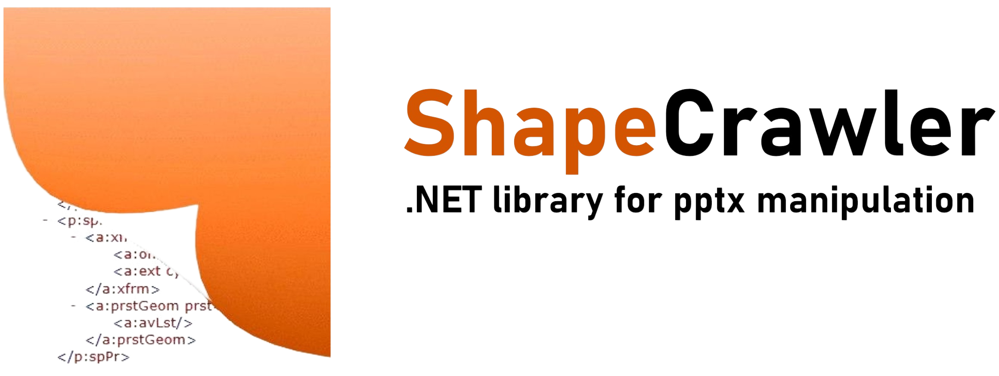

<h3 align="center">



</h3>

<h3 align="center"> 

[](https://www.nuget.org/packages/ShapeCrawler)  [](LICENSE) 

</h3>

ShapeCrawler (formerly SlideDotNet) is a .NET library for manipulating PowerPoint presentations. It provides a simplified object model on top of the [Open XML SDK](https://github.com/OfficeDev/Open-XML-SDK), allowing users to process presentations without having Microsoft Office installed.

⚠️**Warning:** Since February, the library collects usage data to help us to improve your experience. You can opt out of telemetry. For more details, please visit [Statistics Collection](https://github.com/ShapeCrawler/ShapeCrawler#statistics-collection).

## Getting Started

> `install-package ShapeCrawler`

### Usage

#### Read presentation

```c#
// Open existing presentation
using var pres = SCPresentation.Open("some.pptx");

var shapeCollection = pres.Slides[0].Shapes;

// Get number of shapes on slide
var slidesCount = shapeCollection.Count;

// Get text
var autoShape = shapeCollection.GetByName<IAutoShape>("TextBox 1");
var text = autoShape.TextFrame!.Text;
```

#### Create presentation

```c#
// Create a new presentation
var pres = SCPresentation.Create();

var shapeCollection = pres.Slides[0].Shapes;

// Add new shape
var addedShape = shapeCollection.AddRectangle(x: 50, y: 60, w: 100, h: 70);

addedShape.TextFrame!.Text = "Hello World!";

pres.SaveAs("my_pres.pptx");
```

### More samples

Visit the [**Wiki**](https://github.com/ShapeCrawler/ShapeCrawler/wiki/Examples) page to find more usage samples.

## Have questions?

If you have a question:
- [Join](https://github.com/ShapeCrawler/ShapeCrawler/discussions/categories/q-a) our Discussions Forum  and open a discussion;
- You can always email the author at theadamo86@gmail.com

## Contributing
How can you contribute?
- **Give a Star**⭐ If you find this useful, please give it a star to show your support.
- **Bug report**. If you encounter an issue, report the bug on the [issue](https://github.com/ShapeCrawler/ShapeCrawler/issues) page.
- **Code contributing**. Pull Requests are welcome! Please read the [Contribution Guide](https://github.com/ShapeCrawler/ShapeCrawler/blob/master/CONTRIBUTING.md) for more details.


# Changelog  

## Version 0.49.0 - 2023-09-12
🍀Added new `SCAudioType` to be able to add audio shape with different types [#579](https://github.com/ShapeCrawler/ShapeCrawler/issues/579)  
🐞Fixed an issue with Slide Background updating [#577](https://github.com/ShapeCrawler/ShapeCrawler/issues/577)

Visit [CHANGELOG.md](https://github.com/ShapeCrawler/ShapeCrawler/blob/master/CHANGELOG.md) to see the full log.

## Statistics Collection

Since February 15th, the library collects usage data to help us improve your experience. The data is collected by the maintainer and not shared with the community. Rest assured that we do not collect any sensitive or presentation content data. The collection includes, for example, information on the operating system, target framework, and frequently used shape types. If you prefer not to participate in this data collection, you can easily opt-out by setting the global setting `SCSettings.CanCollectLogs = false`.