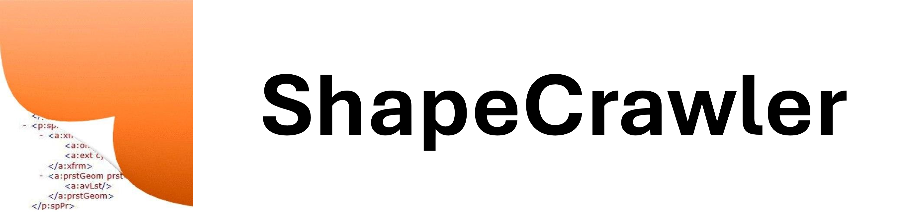

<h3 align="center">



</h3>

<h3 align="center"> 

[](https://www.nuget.org/packages/ShapeCrawler)
[](https://makeapullrequest.com)

[](LICENSE) 
[](https://github.com/ShapeCrawler/ShapeCrawler/issues?q=is%3Aopen+is%3Aissue+label%3A%22good+first+issue%22)
[](https://github.com/ShapeCrawler/ShapeCrawler/issues?q=is%3Aopen+is%3Aissue+label%3A%22help+wanted%22)
[](https://github.com/ShapeCrawler/ShapeCrawler/issues?q=is%3Aopen)

</h3>

ShapeCrawler is a .NET library for manipulating PowerPoint presentations. It provides a simplified object model on top of the [Open XML SDK](https://github.com/OfficeDev/Open-XML-SDK), allowing users to process presentations without having Microsoft Office installed.

## Contents

- [Quick Start](#quick-start)
- [How To?](#how-to)
  - [Create presentation](#create-presentation)
  - [More samples](#more-samples)
- [Prerelease Version](#prerelease-version)
- [Have questions?](#have-questions)
- [How to contribute](#how-to-contribute)
  - [Bug Report](#bug-report)
  - [Code Contributing](#code-contributing)

## Quick Start
> `dotnet add package ShapeCrawler`

```c#
// open existing presentation
using var pres = new Presentation("pres.pptx");

var shapes = pres.Slide(1).Shapes;

// get number of shapes on slide
var shapesCount = shapes.Count;

// get text
var shape = shapes.GetByName("TextBox 1");
var text = shape.TextBox!.Text;
```

## How To?

### Create presentation

```C#
// create a new presentation
var pres = new Presentation();

var shapes = pres.Slide(1).Shapes;

// add new shape
shapes.AddShape(x: 50, y: 60, width: 100, height: 70);
var addedShape = shapes.Last();

addedShape.TextBox!.Text = "Hello World!";

pres.Save("my pres.pptx");
```

### Update picture
```C#
using var pres = new Presentation("pres.pptx");

// get picture shape
var picture = pres.Slide(1).Picture("Picture 1");

// change image
var image = System.IO.File.OpenRead("new-image.png");
picture.Image!.Update(image);

// get MIME type of image, eg. "image/png"
var mimeType = picture.Image!.Mime;

pres.Save();
```


### More samples
You can find more usage samples by visiting the [**Wiki page**](https://github.com/ShapeCrawler/ShapeCrawler/wiki/Examples) or [**Unit Tests folder**](https://github.com/ShapeCrawler/ShapeCrawler/tree/master/test/ShapeCrawler.Tests.Unit).

## Prerelease Version
To access prerelease builds from `master` branch, add `https://www.myget.org/F/shape/api/v3/index.json` as a NuGet package source.

## Have questions?

If you have a question:
- [Join](https://github.com/ShapeCrawler/ShapeCrawler/discussions/categories/q-a) our Discussions Forum  and open a discussion;
- You can always email the author at theadamo86@gmail.com

## How to contribute?
Give a star⭐ if you find this useful, please give it a star to show your support.

### Bug Report
If you encounter an issue, report the bug on the [issue](https://github.com/ShapeCrawler/ShapeCrawler/issues) page.

To be able to reproduce a bug, it's often necessary to have the original presentation file attached to the issue description. If this file contains confidential data and cannot be shared publicly, you can securely send it to theadamo86@gmail.com. Of course, if your security policy allow this. We assure you that only the maintainer will access this file, and it will not be shared publicly.

### Code contributing
Pull Requests are welcome! Please read the [Contribution Guide](https://github.com/ShapeCrawler/ShapeCrawler/blob/master/CONTRIBUTING.md) for more details.

## Changelog  

### Version 0.64.2 - 2025-03-12
🐞Fixed saving presentation in file stream [#953](https://github.com/ShapeCrawler/ShapeCrawler/issues/953)

Visit [CHANGELO.md](https://github.com/ShapeCrawler/ShapeCrawler/blob/master/CHANGELOG.md) to see the full change history.